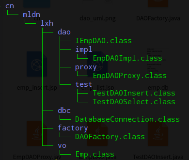
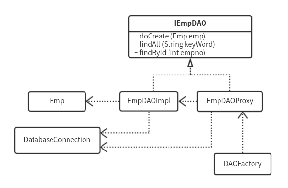

### 简介

本目录的内容，是阅读《Java Web开发实战经典》过程中，跟随书本写下的练习代码。在每一个章节结束后，稍微作非常非常非常简单的回顾。

#### 开始使用JSP

从 4.3.2 Tomcat安装 (P77) 开始。

配置安装JDK和Tomcat后，新建并配置了虚拟目录，也就是本目录。虚拟目录下的WEB-INF/web.xml是核心配置文件，不过配置虚拟目录必然要修改Tomcat的conf/server.xml，将虚拟目录添加到服务器配置中。

4.4 从编写第一个JSP文件开始，4.5 则用于体现Web的交互性。

5.1 测试了JSP中的三种注释形式，5.2 为Scriptlet的三种写法，5.3 使用新形式的Scriptlet来替换旧版的标签。5.4 使用功能 page 指令对JSP页面进行了一系列配置。

5.4.4 是数据库的连接操作，相对之前代码量稍微大一点。要注意mysql的驱动包必须放在Tomcat的lib目录下，Tomcat服务器是不会从环境变量配置的路径中寻找包的。

5.5 练习了JSP页面的两种包含其它页面的方法，5.6 使用跳转指令来使页面跳转，这些跳转都属于服务器跳转。

5.7 是实例操作的一节，使用JSP和JDBC模拟用户的登录验证，从MySQL中读取数据并判断是否正确，将结果储存到标志位，查询结束之后根据标志位跳转到不同的页面。

#### JSP内置对象

JSP主要有9个内置对象。

6.2分别解释了JSP中4中属性的保存范围，包括page、request、session和application。与其他语言稍有不同的是，JSP中服务器跳转与客户端跳转存在差异，会影响到request的作用范围。

6.3详细描述了request对象的内容。request主要接收来自客户端的请求。可接收请求头信息、表单参数等。

6.4详细描述了response对象的内容。response主要对客户端的请求进行回应，可设置头信息的内容，包括定时刷新、页面跳转等。

关于Cookie的操作，因为cookie是服务端设置到客户端上去的，所以要用response来添加cookie。取出cookie则使用request。

6.5是关于session对象的内容。在java web中，session只能使用于HTTP协议。

6.6的application对象可取得当前程序文件执行的真实目录，可以利用这一点来执行一些对文件的操作，持久化数据。

6.7内容关于Web安全性，即WEB-INF目录下的文件是绝对安全的，如果要外部访问，需要在web.xml中手动配置。web.xml中也可配置一些简单的初始化数据。

#### JavaBean

JavaBean可将HTML代码和Java代码分离，HTML页面中使用import导入类或者使用`<jsp:userBean/>`标签声明使用指定类。

JavaBean中的Java程序，如果需要操作属性，必须按照规范编写对应的get和set方法，因为JavaBean标签形式操作属性，默认调用get和set。

将Java编译生成的class文件放到 WEB-INF/classes 目录下，服务器会自动搜寻类。

关于服务器环境，JDK版本一定要不超过8。无论tomcat版本是8还是9，都无法识别JDK9以上版本编译出的class文件。

遇到服务器内部错误时，页面上没有明确的错误信息，包正确导入，但无法正常执行。网上关于该错误信息的言论也不只一种。有认为JDK和JRE版本不一致的，也有认为Tomcat版本过低的。如果检查确认程序没有写错，可以尝试更换JDK版本。

检查Java程序有没有写错，可以单独写一个类来调用测试该程序。而不只是查看JSP页面上的错误信息。

7.8是JavaBean的示例操作，使用正则验证用户由表单输入的信息是否符合要求，错误信息使用Map保存。检查页面调用验证方法，根据不同的检查结果进行页面跳转。

**DAO设计模式**

DAO（Data Access Object，数据访问对象）在程序的标准开发架构中属于数据层的操作，主要功能是数据操作。DAO设计模式大致由6部分组成：

- DatabaseConnection: 专门负责数据库的打开与关闭

- VO：主要由属性的setter、getter方法组成

- DAO：定义操作接口，实现CRUD操作

- Impl：DAO接口的实现类

- Proxy：代理实现类

- Factory：工厂类

包名的命名也要求规范：

| 类 | 包名 |
| --- | --- |
| 数据库连接 | xxx.dbc.DatabaseConnection |
| DAO接口 | xxx.dao.XxxDAO |
| DAO主题类 | xxx.dao.impl.XxxDAOImpl |
| DAO代理类 | xxx.dao.proxy.XxxDAOProxy |
| VO类 | xxx.vo.Xxx |
| 工厂类 | xxx.factory.DAOFactory |

7.9节使用了DAO设计模式来完成一个简单的实例，实例对本地数据库进行操作，可添加数据和查询数据。

7.9节的实例文件共6个，分别对应设计模式规划的6个部分，其包结构如下：

这6个类的功能关系、调用流程：

IEmpDAO是DAO接口，EmpDAOImpl是主题实现类，EmpDAOProxy是代理类，Emp即VO，DatabaseConnection专门实现数据库的连接与关闭。

测试程序从工厂类 DAOProxy 中获取的是代理类 EmpDAOProxy 对象，代理类通过使用主题类 EmpDAOImpl 完成数据操作，主题类和代理类均使用到了 Emp 和 DatabaseConnection。

因为DAO是一种设计模式，所以从功能上来看，整个流程只是完成了一些数据操作的功能，不同的是加入了一些工程化的流程和规范，这也是我们需要重点学习的地方。

程序编写完成后，先写两个测试程序来验证程序是否正常执行，之后在JSP页面调用相应的功能即可。

#### Servlet

Servlet包是tomcat的库，可能不在系统默认的环境变量中。

Servlet程序的生命周期受到Web容器的控制，当一个Servlet被实例化后，容器会调用init()方法。当有请求提交时，Servlet将调用service()方法。

9.8节提到了Web开发的两种模式。模式1使用JSP + JavaBean的结构，适合小型程序开发。

模式2即MVC模式，JSP、JavaBean和Servlet分别对应V、M、C。Servlet处理请求，可调用JavaBean；JavaBean使用DAO模式执行数据操作；JSP进行输出。

9.9节是实例操作，使用MVC设计模式完成一个简单的登录验证功能。

Servlet具备很多JSP不具备的功能，Servlet包括简单Servlet、过滤Servlet和监听Servlet。

过滤Servlet可对指定路径的请求进行过滤，可应用于编码过滤、权限验证等。

监听Servlet是对ServletContext的监听，像设置属性、删除属性。

#### 表达式语言

EL是在JSP2.0之后新增加的功能，利用反射的机制，方便输出4中属性范围中的内容，结合MVC设计模式，可以使JSP页面简化。

EL可操作JSP页面的内置对象。

10.5是一些EL的操作运算符的测试。

### Tomcat数据源

在tomcat中使用连接池，先配置server.xml文件，再修改web.xml，可以直接在JSP中查询数据源。

查找数据源一般三个步骤：初始化名称查找上下文、通过名称查找DataSource对象、通过DataSource取得一个数据库连接池。
